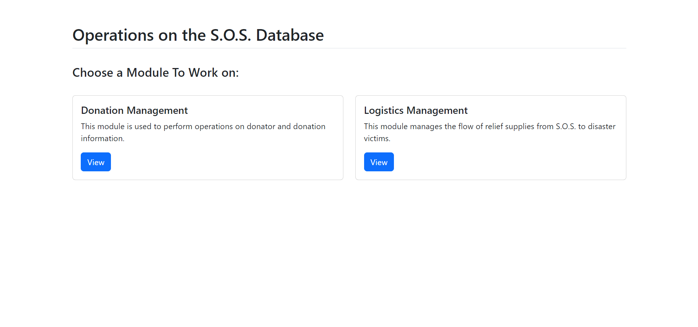
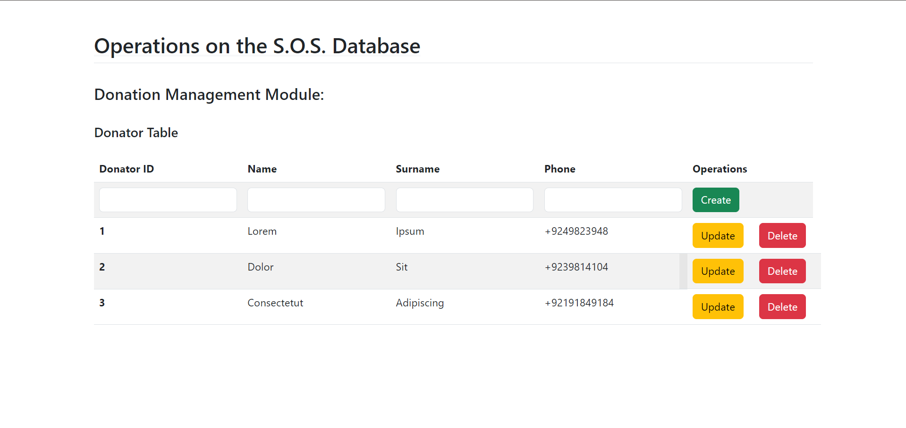

# CRUD Application for Disaster Management Database

The application performs CRUD (Create, Read, Update, Delete) operations on the MySQL database using a web application. There are two modules named as Donation Management and Logistics Management, each having two sections. You can see homepage of the application below:

The Donation Management module has sections which are concerned with donator and donation item information. The Logistics Management module has two sections: insourcing and outsourcing. Insourcing table is the logistics information of transportation carried out by the company itself, while outsourcing table records logistics performed by third party companies. As an example, the donator information section is shown below:

# Instructions

The application is made using Flask framework, to make the application work you need to import database model from "database" folder and configure server with the relevant credentials set up in "app.py" file. After a successful connection, create a virtual environment and install the requirements. Finally, `flask run` command in the console. Click the local website link to access the application.
